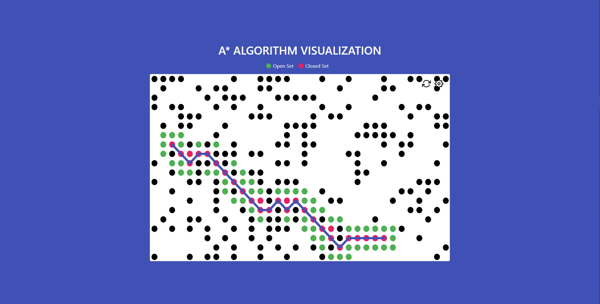

# A* Algorithm visualized

Understand the workings of the A* algorithm through visualization.



The black dot represents the wall. It means that it cannot be considered for a movement. Green dot is the open set, pink is the closed set and the purple trace is the path chosen by the algorithm. In case there is no movement is possible the algorithm will alert after running through all possibilities.

To view the project, you need to run any kind of server. Example using PHP:

```php
php -S localhost:8000
```

---

`http-server` is installed by default via npm. To use it run:
1. `npm install`
2. `npm start`
3. Visit [http://localhost:8080](http://localhost:8080)

---

To customize the render parameters, hit the settings button in the top right corner.
An option to change the number of rows, number of columns, frame rate, cost of diagonal movement and an option to enable/disable diagonal movements are available on the settings page.

Click on any two points to set the start and end nodes. Click on the reload button on the top to generate a new grid.
